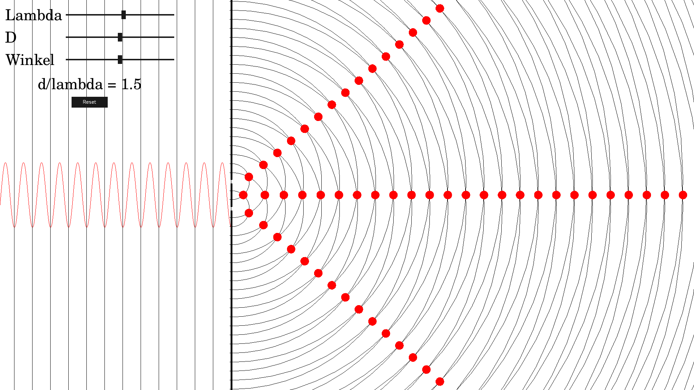

# Doppelspalt LibGDX App

## Live Demonstration

[Doppelspalt Web Preview](https://doppel.zeitner.me/)

## Overview

---

A [libGDX](https://libgdx.com/) project generated with [gdx-liftoff](https://github.com/tommyettinger/gdx-liftoff).

## Platforms

- `core`: Main module with the application logic shared by all platforms.
- `lwjgl3`: Primary desktop platform using LWJGL3.
- `html`: Web platform using GWT and WebGL. Supports only Java projects.

